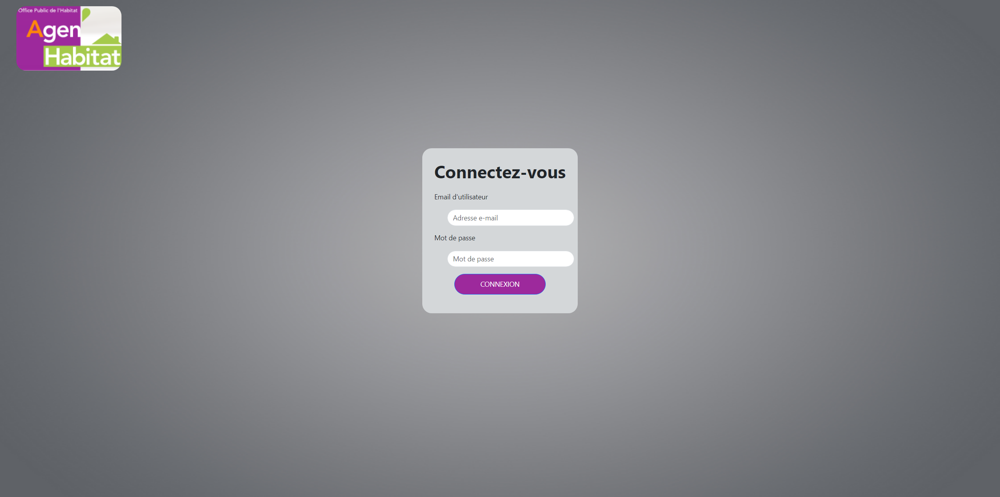
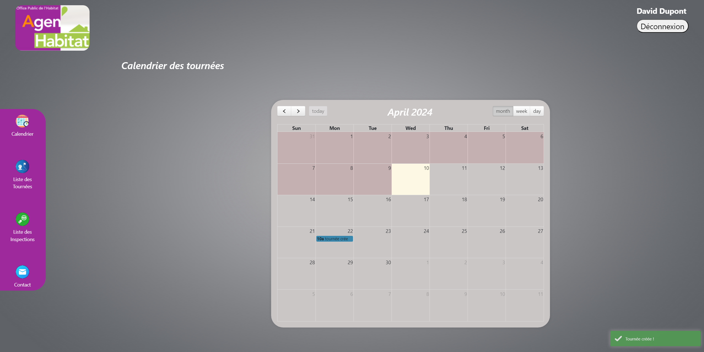
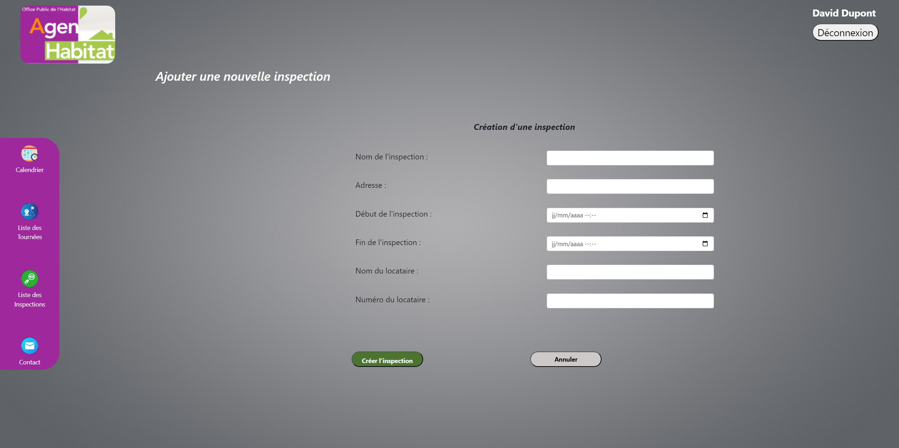
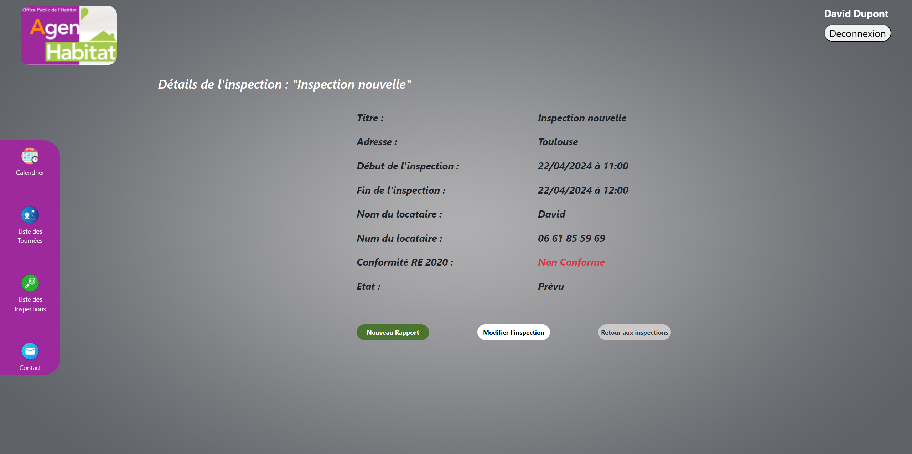
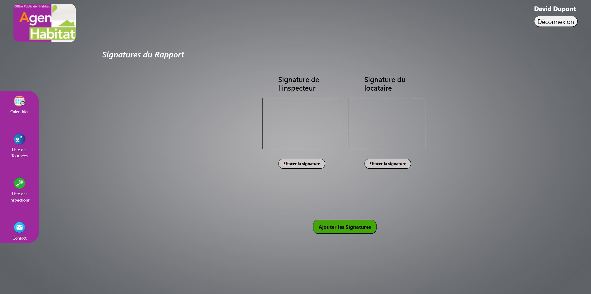
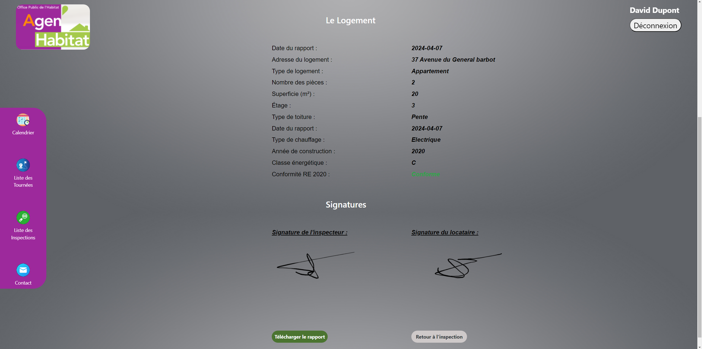

<h1>Présentation :</h1>
Web app laravel permettant à agenHabitat (bailleur social) de réaliser des inspections de logements (prototype)

<h1>Quelques pages de l'Application Web:</h1>

<h2>Page de Connexion</h2>

  

<h2>Page du Calendrier</h2>

  

<h2>Page de la création d'une inspection</h2>

  

<h2>Page du détails d'une inspection</h2>

  

<h2>Page de l'espace signature</h2>

  

<h2>Page du détails du rapport généré</h2>

  

